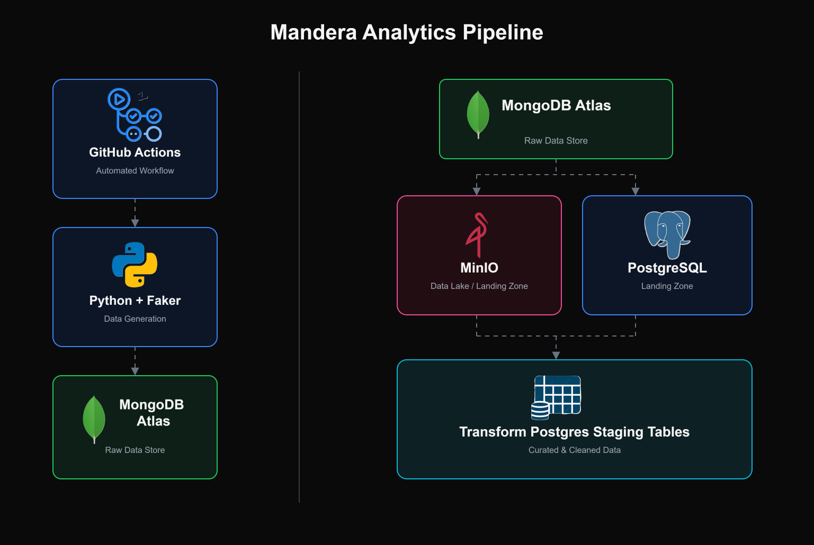
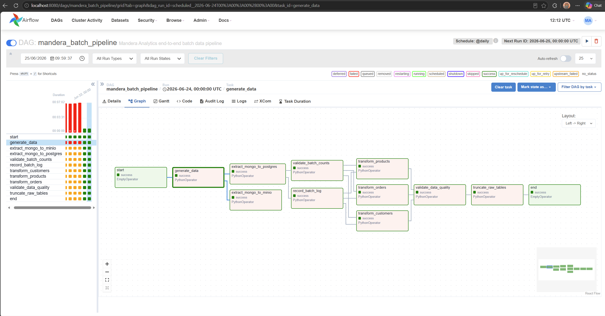

# Mandera-Batch-Analytics-Pipeline

## Project Overview

Mandera Analytics needed a way to turn continuous operational transaction data into trusted analytics datasets - without relying on manual exports or spreadsheet reconciliation. This project builds that pipeline end-to-end: synthetic transactional records are generated automatically, preserved in raw landing zones, validated for completeness, and transformed into clean, analytics-ready staging tables, with every stage observable and traceable back to its source batch.


---

## Architecture Overview



---

## Technology Stack

| Layer | Tool |
|---|---|
| Data Generation | Python, Faker |
| Scheduling / CI | GitHub Actions |
| Operational Source | MongoDB Atlas |
| Object Storage | MinIO |
| Warehouse | PostgreSQL |
| Transformation | Pandas |
| Orchestration | Apache Airflow (CeleryExecutor + Redis) |
| Custom Airflow Image | Dockerfile.airflow |

---

## Quick Start

### Prerequisites (one-time, manual)

**1. Clone and install**
```bash
git clone https://github.com/samuelede/Mandera-Batch-Analytics-Pipeline.git
cd Mandera-Batch-Analytics-Pipeline
python -m venv venv && source venv/bin/activate   # Windows: venv\Scripts\activate
pip install -r requirements.txt
cp .env.example .env
```

**2. MongoDB Atlas** - create a free M0 cluster at [cloud.mongodb.com](https://cloud.mongodb.com). Allow `0.0.0.0/0` under Network Access. Copy the connection string into `.env` as `MONGO_URI`. Set `MONGO_DB` to the database name shown in Atlas Data Explorer (independent of the cluster name).

**3. Airflow Fernet key** - generate once and paste into `.env` as `AIRFLOW__CORE__FERNET_KEY`:
```bash
python -c "from cryptography.fernet import Fernet; print(Fernet.generate_key().decode())"
```

---

### Run the pipeline

Once the three prerequisites above are done, a single script handles everything else - building the Airflow image, starting all Docker services, creating the database schema, initialising Airflow, and triggering a run:

```bash
bash run_pipeline.sh
```

| Flag | When to use |
|---|---|
| `bash run_pipeline.sh` | Normal start - uses existing image if already built |
| `bash run_pipeline.sh --build` | Rebuild Airflow image first (after changing `requirements-airflow.txt` or `Dockerfile.airflow`) |
| `bash run_pipeline.sh --fresh` | Wipe all volumes and start completely clean |

The script confirms progress at each stage and prints service URLs on completion:

| Service | URL |
|---|---|
| Airflow UI | http://localhost:8080 |
| MinIO Console | http://localhost:9001 |
| pgAdmin | http://localhost:5050 |

---

### What success looks like

Every task turns green in dependency order - `start` → `generate_data` → parallel extraction → parallel monitoring → parallel transforms → `validate_data_quality` → `truncate_raw_tables` → `end`:



If a task shows orange (`upstream_failed`), check the task immediately upstream - Airflow won't run a task whose dependency failed.

---

## How It Works

### Hostname resolution by context

- **Local shell scripts** use `localhost:5433` in `.env` (port remapped to avoid conflicts with a native Postgres install).
- **Airflow tasks inside Docker** use internal service names (`postgres:5432`, `minio:9000`) - set explicitly in `docker-compose.yml`, not inherited from `.env`.
- **GitHub Actions** workflows define their own connection values per job - never read from `.env`.

### Configuration

`config/settings.py` is the single source of truth for every connection string and table name. `config/data_quality.py` controls bad-data injection rates and has zero database awareness - generator scripts can run standalone with no `.env`.

### Dependency management - two requirements files

`requirements.txt` pins exact versions for local development. `requirements-airflow.txt` (used only inside `Dockerfile.airflow`) leaves all versions unpinned, letting Airflow 2.9.2's own `--constraint` file govern resolution. An exact pin in a requirements file overrides constraints - this caused build failures before the split was introduced.

`pandas` and `pyarrow` are intentionally held at `2.2.2` / `16.1.0` - pandas 3.0 has confirmed breaking changes and the transform scripts were built against 2.2.2.

---

## Pipeline Stages

| Stage | Script | Description |
|---|---|---|
| Generate | `generator/data_generator.py` | Synthetic records with deliberately injected bad data, pushed to MongoDB Atlas |
| Extract → Lake | `extraction/extract_mongo_to_minio.py` | Partitioned Parquet files in MinIO |
| Extract → Warehouse | `extraction/extract_mongo_to_postgres.py` | Idempotent load into `raw.*_raw` |
| Monitor | `validation/validate_batch_counts.py`, `maintenance/record_batch_log.py` | Row-count variance - two complementary views |
| Transform | `transformation/transform_*.py` | Dedup, null replacement, type enforcement, derived fields → `staging.*_clean` |
| Validate Quality | `validation/validate_data_quality.py` | Field-level checks on staging |
| Truncate | `maintenance/truncate_raw_tables.py` | Clears `raw.*_raw` only after every entity's transform succeeds |

---

## GitHub Actions

Two independent workflows in `.github/workflows/`:

- **`generate_data.yml`** - generator only. Triggers: scheduled cron, `pull_request`, `workflow_dispatch`.
- **`run_full_pipeline.yml`** - full pipeline against ephemeral Postgres + MinIO containers. Triggers: `push`/`pull_request` to `main`, `workflow_dispatch`.

**Required repository secrets:**

| Secret | Value |
|---|---|
| `MONGO_URI` | Atlas connection string |
| `MONGO_DB` | Atlas database name |
| `CI_POSTGRES_PASSWORD` | Any value (ephemeral CI container only) |
| `CI_MINIO_PASSWORD` | Any value, 8+ characters |

---

## Known Limitations

- Bad-data injection rates (`config/data_quality.py`) are aggressive by design (~0.3–0.4 per field) - staging can legitimately retain well under half of a raw batch. This is intentional stress-testing of the validation layer, not a defect.
- Forgetting to pass `--build` after changing `requirements-airflow.txt` or `Dockerfile.airflow` is a common source of `ModuleNotFoundError` inside Airflow - always rebuild explicitly.

---

## Contributing

1. Branch from `main`: `git checkout -b feat/your-change`
2. Keep `config/settings.py` as the only place connection strings and table names are defined.
3. Update the relevant `sql/*.sql` file directly for schema changes - no separate migration files.
4. Test locally before opening a PR - run the affected script against a real batch and verify the output table directly.
5. Open a PR against `main`; `run_full_pipeline.yml` runs automatically and must pass before merging.
6. Keep commit messages specific about what changed and why.

---

## License

MIT
