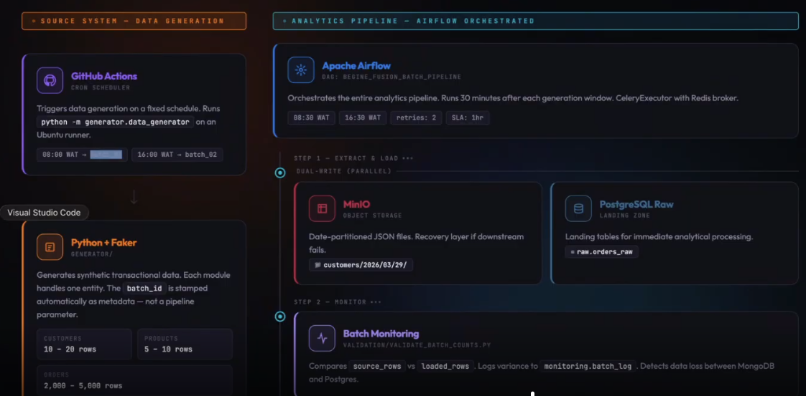

# Mandera-Batch-Analytics-Pipeline

## Project Overview

Mandera Analytics needed a way to turn continuous operational transaction data into trusted analytics datasets - without relying on manual exports or spreadsheet reconciliation. This project builds that pipeline end-to-end: synthetic transactional records are generated automatically, preserved in raw landing zones, validated for completeness, and transformed into clean, analytics-ready staging tables, with every stage observable and traceable back to its source batch.


---

## Architecture Overview



---

## Technology Stack

| Layer | Tool |
|---|---|
| Data Generation | Python, Faker |
| Scheduling / CI | GitHub Actions |
| Operational Source | MongoDB Atlas |
| Object Storage | MinIO |
| Warehouse | PostgreSQL |
| Transformation | Pandas |
| Orchestration | Apache Airflow (CeleryExecutor + Redis) |
| Custom Airflow Image | Dockerfile.airflow |

---

## Important: Where Each Service Runs

**MongoDB Atlas** is cloud-hosted - no local setup beyond an Atlas account and IP allowlisting.

**PostgreSQL, MinIO, Redis, pgAdmin, and Airflow** run as Docker containers via `docker-compose.yml`.

**Hostname resolution differs by context:**
- Scripts run directly from your shell (e.g. `python extraction/extract_mongo_to_postgres.py`) need `localhost` in `.env` - `POSTGRES_PORT=5433` specifically (remapped from 5432 to avoid conflicting with a native Postgres install on some systems).
- The same scripts running as Airflow tasks inside Docker use internal service names (`postgres`, `minio`) - these are set explicitly in `docker-compose.yml`, not inherited from `.env`, since the two contexts need different values for the same logical service.
- GitHub Actions workflows define their own connection values entirely separately (see below) - never read from a committed `.env`.

---

## Configuration

`config/settings.py` is the single source of truth for every connection string and table name - `RAW_TABLES`, `STAGING_TABLES`, `MONGO_COLLECTIONS`. No script hardcodes these independently. `MONGO_URI` is validated lazily via `validate_mongo_config()`, called only by code that opens a live connection - so importing `settings.py` never requires `.env` to exist.

`config/data_quality.py` controls bad-data injection rates per entity (missing/invalid emails, non-positive prices, invalid statuses, category mismatches, duplicates) and has zero database awareness - the `faker_*.py` generators can run standalone with no `.env` at all.

---

## Dependency Management - Two Separate Requirements Files
 
`requirements.txt` pins exact versions for local/host development.
`requirements-airflow.txt` is used only inside `Dockerfile.airflow`
and deliberately leaves every package **unpinned**.
 
This split exists because Airflow 2.9.2 ships with its own
`--constraint` file pinning compatible dependency versions (notably
SQLAlchemy ~1.4.x). An exact pin in a requirements file always
overrides a constraint file in pip's resolution - so pinning
`sqlalchemy==2.0.x` or `pandas==2.2.2` inside the Airflow image broke
Airflow's own ORM models outright. Leaving `requirements-airflow.txt`
unpinned lets Airflow's constraints win for any package it has tested
against, while `requirements.txt` keeps full reproducibility for
local development.
 
**`pandas` and `pyarrow` are intentionally NOT bumped** to their
current major releases in `requirements.txt` - pandas 3.0 has
confirmed breaking changes, and every `transform_*.py` script was
developed and tested against pandas 2.2.2. Don't bump these without
re-testing the transform scripts first.
---

## Quick Start

### 1. Clone & Install

```bash
git clone https://github.com/your-username/mandera-batch-analytics-pipeline.git
cd mandera-batch-analytics-pipeline
python -m venv venv
source venv/bin/activate   # Windows: venv\Scripts\activate
pip install -r requirements.txt
cp .env.example .env
```

### 2. MongoDB Atlas

Create a free M0 cluster at [cloud.mongodb.com](https://cloud.mongodb.com). Under **Network Access**, allow `0.0.0.0/0`. Under **Database Access**, create a user. Copy the connection string into `.env` as `MONGO_URI`. Set `MONGO_DB` to the actual **database** name shown in Atlas Data Explorer - note this is independent of the **cluster** name (they commonly look similar but are not the same thing).

### 3. Generate a Fernet key (required for Airflow)

```bash
pip install cryptography
python -c "from cryptography.fernet import Fernet; print(Fernet.generate_key().decode())"
```
Paste the output into `.env` as `AIRFLOW__CORE__FERNET_KEY`.

### 4. Build and start Docker services
 
The Airflow containers build from `Dockerfile.airflow` (which installs
this project's own dependencies on top of the stock Airflow image) -
this build step is required before the first `up`, or Docker will
silently fall back to an image with none of your project's packages
installed.
 
```bash
docker compose build airflow-webserver airflow-scheduler airflow-worker
docker compose up -d
docker compose ps   # confirm postgres, minio, redis show "healthy"
```
 
If you change `requirements-airflow.txt` later, rebuild with
`--no-cache` to force a clean reinstall:
```bash
docker compose build --no-cache airflow-webserver airflow-scheduler airflow-worker
docker compose up -d --force-recreate airflow-webserver airflow-scheduler airflow-worker
```

### 5. Create the database schema (manual - see Known Limitations)

```bash
docker exec -it mandera-postgres psql -U pipeline -d postgres -c "CREATE DATABASE mandera_warehouse;"
docker exec -it mandera-postgres psql -U pipeline -d mandera_warehouse -f /sql/create_raw_tables.sql
docker exec -it mandera-postgres psql -U pipeline -d mandera_warehouse -f /sql/create_staging_tables.sql
docker exec -it mandera-postgres psql -U pipeline -d mandera_warehouse -f /sql/monitoring_tables.sql
```
On Windows/Git Bash, prefix each `docker exec` command with `MSYS_NO_PATHCONV=1` to stop path auto-translation from corrupting the `/sql/...` path.

### 6. Initialize Airflow (one-time)

```bash
docker exec -it mandera-airflow-webserver airflow db init
docker exec -it mandera-airflow-webserver airflow users create \
  --username admin --password admin \
  --firstname Mandera --lastname Admin \
  --role Admin --email admin@mandera.com
```

### 7. Run it

```bash
python generator/data_generator.py
```
Or trigger the full DAG via the Airflow UI at `http://localhost:8080` (unpause `mandera_batch_pipeline` first - new DAGs start paused).

| Service | URL |
|---|---|
| Airflow UI | http://localhost:8080 |
| MinIO Console | http://localhost:9001 |
| pgAdmin | http://localhost:5050 |

---

### What success looks like
 
Once triggered, every task should turn green in dependency order - `start` → `generate_data` → parallel extraction → parallel monitoring → parallel transforms → `validate_data_quality` → `truncate_raw_tables` → `end`:
 

 
If a task instead shows orange (`upstream_failed`), check the task immediately upstream first - Airflow won't run a task whose dependency failed.
---

## Pipeline Stages

| Stage | Script | Description |
|---|---|---|
| Generate | `generator/data_generator.py` | Synthetic records + deliberately injected bad data, pushed to MongoDB Atlas |
| Extract → Lake | `extraction/extract_mongo_to_minio.py` | Partitioned Parquet files in MinIO |
| Extract → Warehouse | `extraction/extract_mongo_to_postgres.py` | Idempotent load into `raw.*_raw` |
| Monitor | `validation/validate_batch_counts.py`, `maintenance/record_batch_log.py` | Row-count variance, two complementary views |
| Transform | `transformation/transform_*.py` | Dedup, null replacement, type enforcement, naming, derived fields → `staging.*_clean` |
| Validate Quality | `validation/validate_data_quality.py` | Field-level checks on staging |
| Truncate | `maintenance/truncate_raw_tables.py` | Clears `raw.*_raw` only if every entity's transform succeeded |

---

## GitHub Actions

Two independent workflows in `.github/workflows/`:

- **`generate_data.yml`** - runs the generator only. Triggers: scheduled cron, `pull_request`, `workflow_dispatch`.
- **`run_full_pipeline.yml`** - runs the entire pipeline against ephemeral Postgres + MinIO containers (schema created fresh every run, no persistent volume). Triggers: `push`/`pull_request` to `main`, `workflow_dispatch`.

**Required repository secrets** (Settings → Secrets and variables → Actions):

| Secret | Value |
|---|---|
| `MONGO_URI` | Atlas connection string |
| `MONGO_DB` | Atlas database name |
| `CI_POSTGRES_PASSWORD` | Any value - protects an ephemeral CI container only |
| `CI_MINIO_PASSWORD` | Any value, 8+ characters |

---

## Known Limitations

- **Schema setup is manual**, both locally and is re-run fresh in every CI job - there's no `airflow-init`-style automated step yet for local Docker setup. Tracked as a deliberate, deferred improvement.
- **Bad-data injection rates** (`config/data_quality.py`) are aggressive by design (~0.3–0.4 per field) - staging can     legitimately retain well under half of a raw batch. This is intentional stress-testing of the validation layer, not a defect.
- **Airflow's container requires a separate, unpinned requirements
  file** (`requirements-airflow.txt`) rather than reusing
  `requirements.txt` directly - see "Dependency Management" above.
  Forgetting to rebuild after changing this file is a common source
  of confusing `ModuleNotFoundError` or `ResolutionImpossible` errors;
  always rebuild explicitly, don't rely on `docker compose up` alone
  to pick up Dockerfile changes.

---

## Contributing

1. Branch from `main`: `git checkout -b feat/your-change`
2. Keep `config/settings.py` as the only place connection strings and table names are defined - scripts should import from it, never hardcode.
3. If you add a new table or column, update the relevant `sql/*.sql` file directly rather than introducing a separate migration file, so a fresh clone only needs one script per schema.
4. Test locally before opening a PR - at minimum, run the affected script against a real batch and confirm output by querying the relevant table directly.
5. Open a PR against `main`; `run_full_pipeline.yml` will run automatically and must pass before merging.
6. Keep commit messages specific about *what* changed and *why* - future debugging in this repo has repeatedly relied on being able to trace a fix back to the error that caused it.

---

## License

MIT